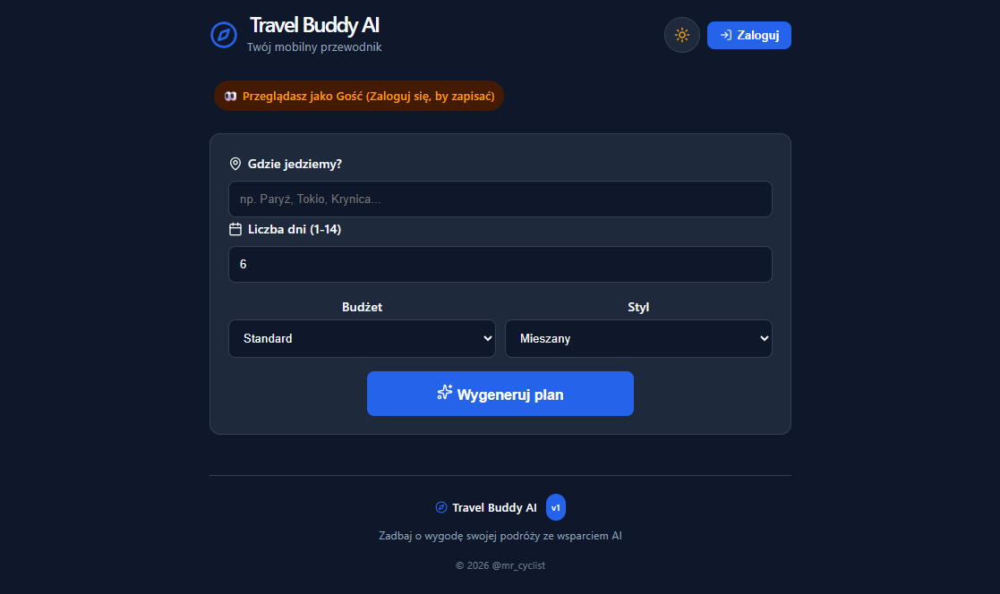
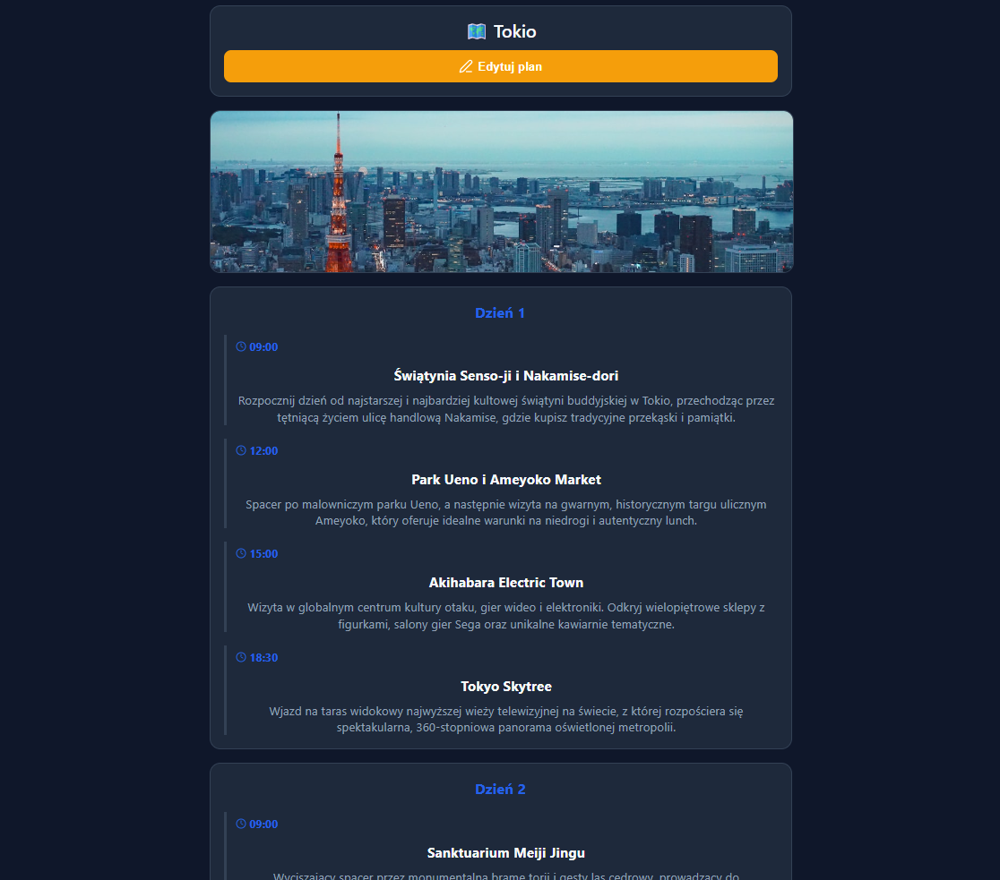
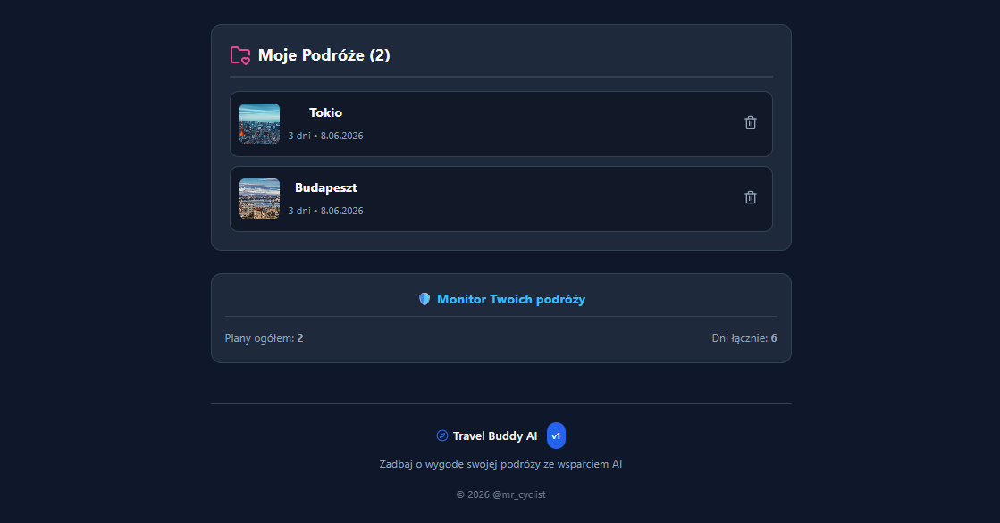
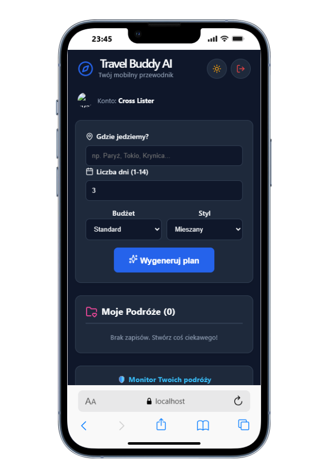
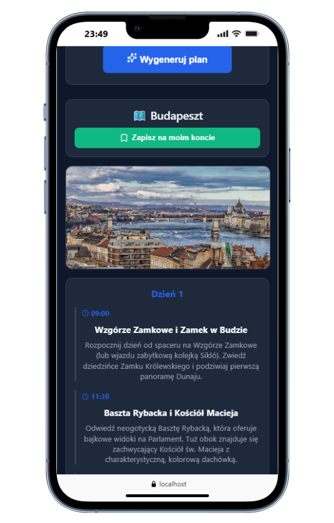

# Travel Buddy AI
This application will help you manage your travels. Fullstack application connected backend and frontend connected with AI.

# Project Name
- This application will help you manage your travel plans. You can generate new itineraries, edit activities, and delete every single plan. Authentication with Google and subsequent logging in at any time will allow you to conveniently access your saved data. Addition of Gemini AI Model that proposes new ideas, activities consistent with your destination, budget and style. Planning a trip has never been more useful and exciting.

# Installation

- npm install command to create node_modules with all features from package.json

## Table of Contents
* [General Info](#general-information)
* [Technologies Used](#technologies-used)
* [Features](#features)
* [Screenshots](#screenshots)
* [Acknowledgements](#acknowledgements)
* [Contact](#contact)

## General Information
- This is a fullstack solution combining React, NodeJS, REST API and Express. An excellent exercise in combining these languages and frameworks, not forgetting about responsiveness. JSON Database and Backend (Node.js/Express) will allow all functionalities to function properly and be saved and restored in the later operation of the application, with access to them at any time for authenticated users. Addition of Gemini AI Model that acts as a professional tour guide, generating full trips, combined with the Unsplash API to dynamically fetch beautiful destination photos.

## Technologies Used
- HTML5 Markup
- CSS 
- RWD - Responsive Web Design 
- JavaScript
- React
- NodeJS
- REST API
- Express
- JSON Database / Local Storage
- Firebase Authentication (Google LogIn)
- Google Gemini AI Model (Flash Latest)
- Unsplash API

## Features
- **Guest Mode:** Anyone can browse the application and generate travel plans without immediate authentication.
- **AI-Powered Generation:** Instant, detailed day-by-day travel plan generation based on destination, days, budget, and travel style.
- **Dynamic Photos:** Automatic destination image fetching directly from Unsplash API.
- **Full In-App Editor:** Authenticated users can modify times, titles, and descriptions of activities, or add new points to the itinerary.
- **Google Authentication:** Secure and quick login using Google Accounts via Firebase Auth.
- **Dark Mode:** Fluid UI color scheme swapping (Light / Dark) for night-time planning comfort.
- **Dashboard Monitor:** Visual statistics and overview of total saved trips and overall days planned.

## Screenshots

## Acknowledgements
- Inspired by a passion for cycling, active travel, and modern AI capabilities.

## Contact
Created by [@mr_cyclist] - contact me!